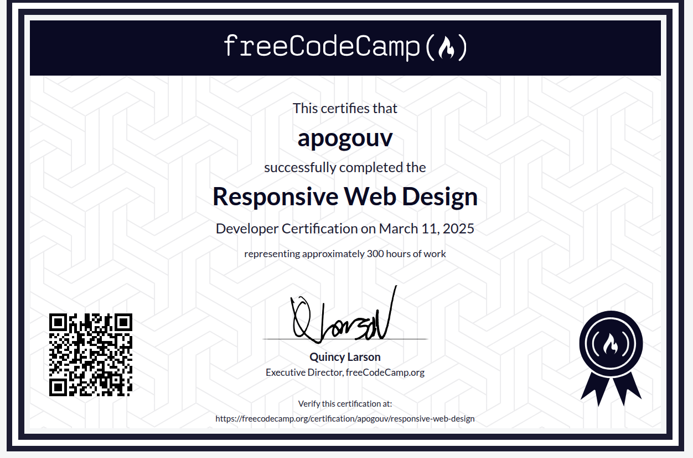

# FreeCodeCamp Responsive Web Design Certification

## Certificate

I have earned the **Responsive Web Design Certification** from freeCodeCamp. You can view the certificate online by following this [link](https://www.freecodecamp.org/certification/apogouv/responsive-web-design).

[](https://www.freecodecamp.org/certification/apogouv/responsive-web-design)

## Projects

Below are the main projects that are part of this certification:

1. **Build a Tribute Page**

2. **Build a Survey Form**

3. **Build a Product Landing Page**

4. **Build a Technical Documentation Page**

5. **Build a Personal Portfolio Webpage**

> These projects are part of the **freeCodeCamp Responsive Web Design** curriculum and are intended to showcase the skills acquired during the course.

## Installation

To view the projects locally, clone this repository:

```bash
git clone https://github.com/ApoGouv/freeCodeCamp.git

cd ./freeCodeCamp/freeCodeCamp-Core-Curriculum/Responsive-Web-Design-Certification
```

Then, you can open the `index.html` file for each project in your web browser.
